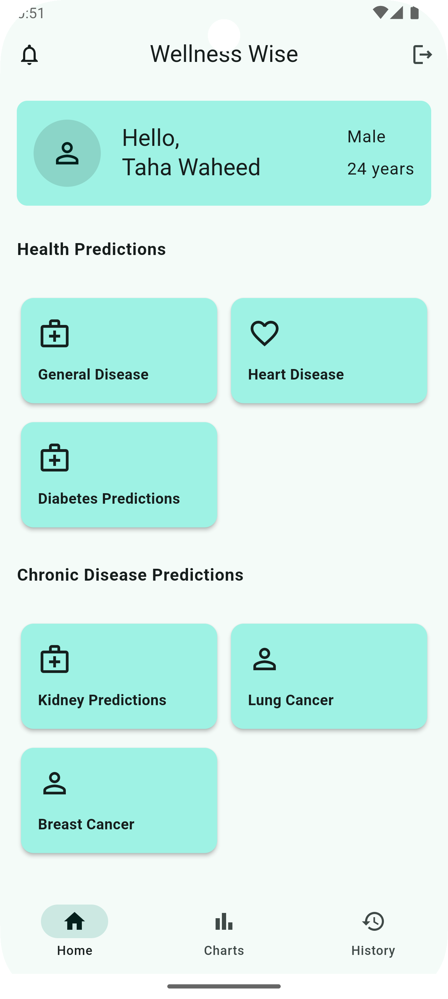
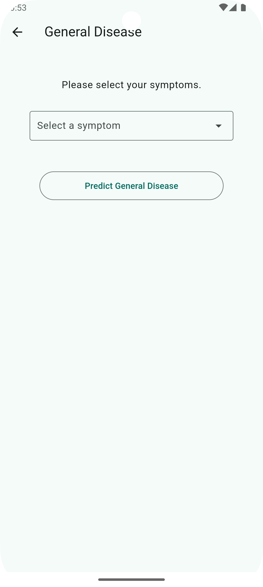

## 📱 Wellness Wise : Your AI Health Navigator

### 🧠 Overview

**Wellness Wise** is a Flutter-based mobile application designed to be a comprehensive guide and personal health assistant, empowering users on their journey toward improved well-being. Leveraging the power of **Artificial Intelligence (AI)**, this app analyzes user data to provide personalized health insights, predictions, and actionable recommendations.

---

### 🎯 Objectives

The primary goal of this project is to create a user-centric mobile solution that:

- Collects and processes user inputs such as **medical history**, **lifestyle habits**, and **real-time health data**
- Utilizes **advanced AI algorithms** to assess potential health risks
- Predicts possible health outcomes based on individual profiles
- Delivers **tailored strategies and recommendations** for improving wellness
- Encourages users to make **informed, proactive health decisions**
- Ultimately enhances overall **quality of life** through better health management
---

### 💻 Technologies Used

- **Flutter** – Cross-platform UI toolkit for building natively compiled mobile applications  
- **Dart** – Primary programming language for Flutter development  
- **Python** – Used for implementing AI models and backend logic  
- **Flask** – Lightweight Python web framework for creating RESTful APIs  
- **Firebase** – Cloud-based backend solution for real-time data storage and authentication  
- **Bloc (Flutter)** – State management solution ensuring a reactive and maintainable codebase
---

### 🚀 Key Features

- Intelligent data analysis using AI
- Personalized health tracking and predictions
- Dynamic wellness recommendations
- User-friendly Flutter interface for smooth navigation
- Support for integration with wearable devices (future scope)
---

### 🖼️ Screenshots
<picture>
  <source srcset="assets/screenshots/home_page.png" media="(max-width: 600px)">
  
</picture>
&nbsp;&nbsp;&nbsp;
<picture>
  <source srcset="assets/screenshots/general_disease_screen.png" media="(max-width: 600px)">
  
</picture>

